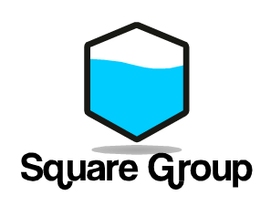

## Echominal Development 

**Basic Info**

Current Version : 1.0.9 Lua (Stable)  
New Dev Version : 2.0 (Batasu-Development Release) (Alpha)  
Engine Version  : 1.3.8  

> This project is currently under heavy development. 
> Currently in **alpha** stage. Please wait for **beta** release. 

**What's New** 

1. New Engine 
2. More and more hacking tools [click here for list](https://github.com/farhansadik/echominal-development/blob/main/dev_files/hacking_tools.md)
3. New installer
4. Bug fixes!
5. Simplicity 

## Contribute
Before contribute please [read this](CONTRIBUTING.md).
1. **DO NOT PUSH/MERGE YOUR CODE IN `master` BRANCH**
2. **PLEASE DEPLOY YOUR CODE IN `development` BRANCH**

**Contributor's :**
[@batasu](https://github.com/batasu)
[@squaredevops](https://github.com/squaredevops)

## Development

**Farhan Sadik**  
***Square Development Group***  

