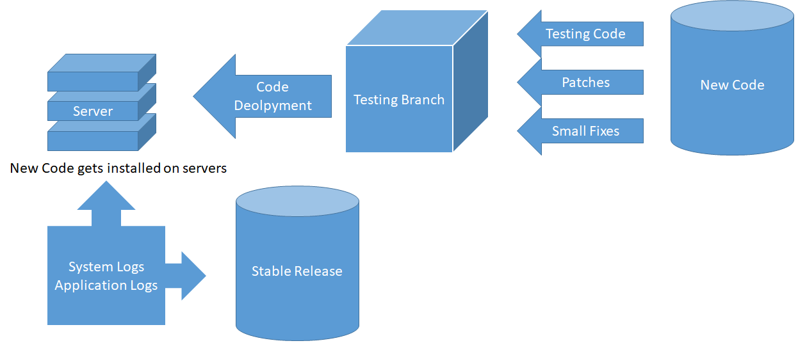
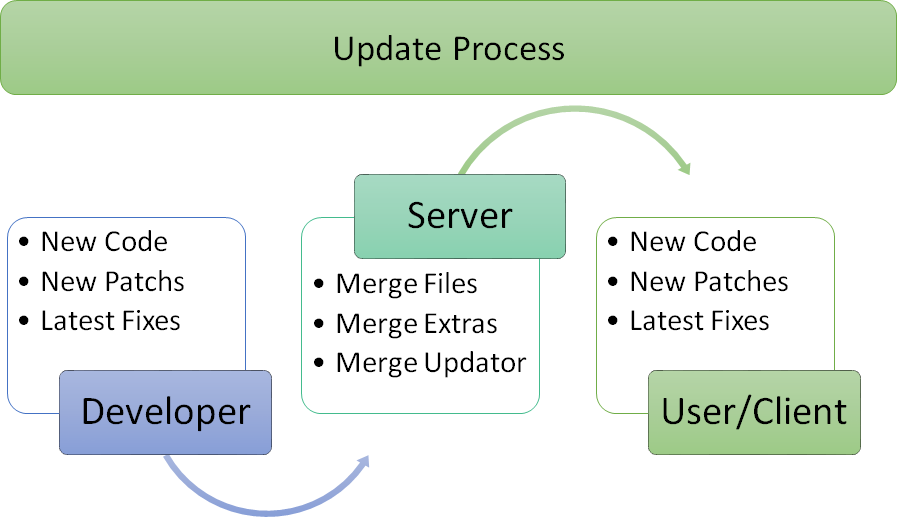

### Environment Setup
**Desktop-Linux**
`.config/echominal` in `$HOME` required for shell config!

> Everything will be placed in $HOME/.config/echominal

**Environment for Test**

1. `cat: $HOME/.config/echominal/shell_style.cfg: No such file or directory`
2. `$HOME/.config/echominal/tools/` - dir

**Android-Termux**
`.config/echominal` required for shell config!
`/sdcard/MP3` required for youtube-dl package
`/sdcard/termux-backup` required for termux backup

### Development Process (R-L)



### Update Process (L-R)



### Git Pull Method

# Update Algorithm for git with bash scripting

### Version 2

Basically this algorithm was created for getting update for bash projects. And as server as git. 

We need 1 separate bash file and 2 separate functions for this method

1. Main Script (which will called by user)
2. Operation Script (for replacing `update` script with previous script)
3. Update Script (In this function developer will have to specify every operation for update/file changes)

## Operation/Main 

This function will called by user. Function's will pull updates from server and then run **update**.

Things to do: 

 1. Pull updates from server 

 2. Run **update** script

```bash 
#!/usr/bin/env bash 
#!/data/data/com.termux/files/usr/bin/bash

script_version="0.5"

log=~/.config/echominal/log/operation-status.log; # for track logs
red='\033[1;91m'; deep_green='\033[0;32m'; green='\033[1;92m'; yellow='\033[1;93m'; blue='\033[1;94m'; white='\033[1;97m'; stop='\e[0m';

function check_for_update() {
	# the update function 
    if which tput >/dev/null 2>&1; then {
        ncolors=$(tput colors)
    }; fi

    if [ -t 1 ] && [ -n "$ncolors" ] && [ "$ncolors" -ge 8 ]; then {
      RED="$(tput setaf 1)"; GREEN="$(tput setaf 2)"; YELLOW="$(tput setaf 3)"; BLUE="$(tput setaf 4)"; BOLD="$(tput bold)"; NORMAL="$(tput sgr0)";
    }; else {
      RED=""; GREEN=""; YELLOW=""; BLUE=""; BOLD=""; NORMAL="";
    }; fi

    printf "${BLUE}%s${NORMAL}\n" "Updating Engine";

    # checking for updates
    if sleep 1; then {
		# git pull --rebase --stat origin master
	  if git pull origin master; then {

	    printf '%s' "$GREEN"
      printf '%s\n' '_____________________'
      printf '%s\n' '< Updating Echominal >'
      printf '%s\n' '---------------------'
			printf '%s\n' '\'
			printf '%s\n' ' \';
			printf '%s\n' '       .--.'
			printf '%s\n' '      |o_o |'
			printf '%s\n' '      |:_/ |'
			printf '%s\n' '     //   \ \'
			printf '%s\n' '    (|     | )'
			printf '%s\n' '   /"\_   _/"\'
			printf '%s\n' '   \___)=(___/'; echo;

      # update script run here !
 	  	# bash $loc/.scripts/operation.bash; echo
	  
	  	# file matching
			update_file=update.bash;

			echo "looking for update script"
			if [[ `ls -a | grep $update_file` == $update_file  ]] ; then {
				echo "found file"; bash $update_file
			}
			else {
				echo "sorry no $update_file has been found"; 
				printf "$red"; printf "Already you're up to date $stop\n"
			} fi
	  
	  } else {
	      printf "$red\n"; printf "Hooray! EchoMinal has been updated or at the current version.\n";
	  } fi

      sleep 0.5
    }; else {
      printf "${RED}%s${NORMAL}\n" 'There was an error updating. Try again later?'
    }; fi
}

# execute 
check_for_update
#if check_for_update; then termux-reload-settings; fi;
```

## Update

This script will do everything for the updates (file creation/copy/move/delete) etc. Developer have to specify everything (every operation) here for updates.

```bash
script_version="0.3"    # prev - 0.1.02

# log
loc=~/EchoMinal/; # default clone location
log=~/.config/echominal/log/operation-status.log; # for track logs
red='\033[1;91m'; deep_green='\033[0;32m'; green='\033[1;92m'; yellow='\033[1;93m'; blue='\033[1;94m'; white='\033[1;97m'; stop='\e[0m';

###################################################
#   PLEASE SPECIFY HERE MANUALLY EVERYTHING       #
#   WHAT UPDATE U BRINGS HERE                     #
#   EVERY TIME YOU'VE TO EDIT THAT SHIT           #
###################################################


function ChangeLog() {

  # mension here
  # what new you brings for echominal 

  printf "\nHurrah\nNew update has been arrived $yellow\n"
  printf "============================$red\n"
  printf "      EchoMinal 1.0.9 $yellow\n"
  printf "       Testing Update $yellow\n"
  printf "============================\n$red"
  printf "*. Install script has been updated\n"
  printf "*. removed 'update zsh'\n"
  printf "*. fixed exit issue (working)\n"
  printf "*. added fixing method for 'broken package'\n"
  #printf "*. \n"
  #printf "*. \n"


  printf "$stop\n"
}

function copy() {
  spin & # calling function
  pid=$! # unknown

  for i in `seq 1 10`
  do
    sleep 0.5
  done

  kill $pid
  echo
}

pWait=('Please Wait' 'pLease Wait' 'plEase Wait' 'pleAse Wait' 'pleaSe Wait' 'pleasE Wait' 'please Wait' 'please wAit' 'please waIt' 'please waiT')
function spin() {
  while [ 1 ]
  do
    for i in "${pWait[@]}"
    do
        echo -ne "\r$i"
        sleep 0.2
    done
  done
}

function UpdateEchominal() {

  # EchoMinal Engine 1.0.9 Lua
  # Replacing File List = engine.bash 

  # getting user permission
  read -p "do u want to update [y/n] " update

  # condition
  if [[ $update == 'y' ]]; then {

    # Simple Animation 
    copy

    # replaceing engine
    printf "Replacing Engine  : ";
    if sleep 0.5; then printf "Done\n"; fi;

    # deleting update script
    printf "Deleting Files    : ";
    if rm -rv update.bash >> $log;  then printf "Done\n"; fi;

  } elif [[ $update == 'n' ]]; then {
      echo "You can update it manually letter"
      echo "bye bye"
  } else {
    printf "Invalid Options\n";
  } fi

  echo
  echo "Thank You"
  echo "Latest Version $engine_version";

}

if ChangeLog; then UpdateEchominal; fi;
```

